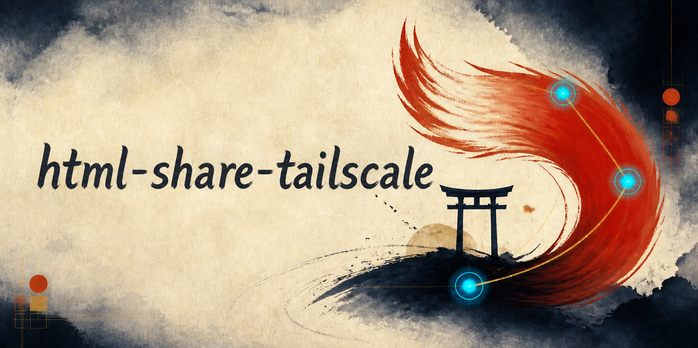
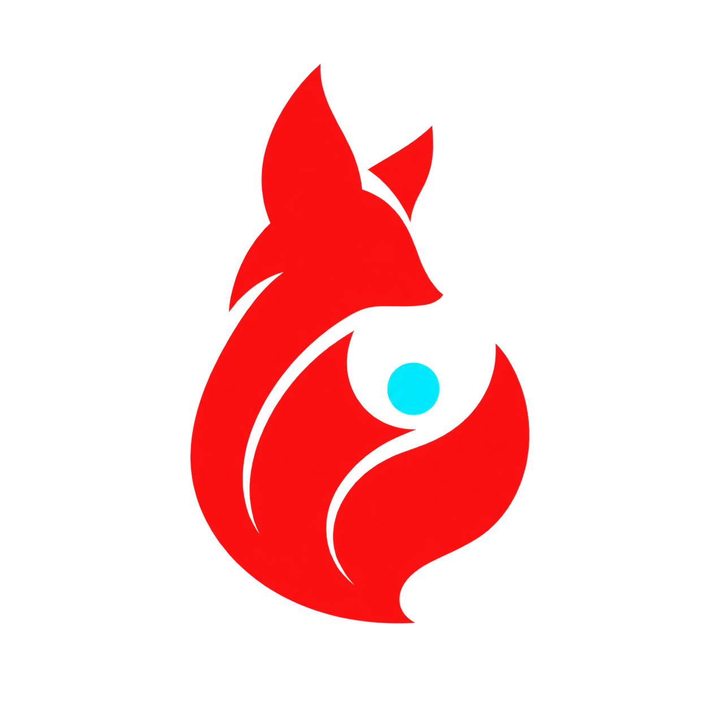

  
  <h1>HTML Share — Tailscale</h1>
  
Tailnet-only HTML review dashboard for Claude Code, Codex, Cursor, and other coding agents.

  

  
  

<a href="README.md">English</a> · <a href="README.ja.md">日本語</a>

HTML Share stores pages and review state on the host PC, then exposes the dashboard through Tailscale Serve so a phone or another Tailnet device can read and respond.

This repository is an independent Tailscale-first fork of [`minorun365/html-share`](https://github.com/minorun365/html-share). The application does not require AWS, S3, CloudFront, Lambda, or an external database.

## ✨ What it does

- Register HTML with `html-share page add` and publish it to the dashboard.
- Keep pages, read marks, stars, review requests, and share tokens in local files.
- Serve the app from a loopback HTTP server behind Tailscale Serve HTTPS.
- Create expiring links that remain reachable only inside the Tailnet.
- Move requests between an agent running on the PC and the `/mobile` or `/inbox` views on a phone.

The red tail in the header is deliberate: it represents a report leaving local storage, crossing the Tailnet, and arriving at the next screen. The torii-like gateway represents the access boundary; the cyan nodes represent asynchronous handoff.

The compact app icon uses a single fox-fire silhouette and one cyan connection point so it remains recognizable as a favicon, PWA icon, and phone home-screen icon.

## 🚀 Quick start

### Requirements

- Node.js 22 or newer
- Tailscale installed on the host PC and the phone connected to the same Tailnet
- Claude Code, Codex, or another agent is optional; the CLI works on its own

### Install

~~~
git clone https://github.com/Sunwood-ai-labs/html-share-tailscale.git
cd html-share-tailscale
npm ci
npm run build
npm link
cp html-share.config.example.yaml html-share.config.yaml
cp .env.example .env
~~~

On Windows PowerShell, use `Copy-Item html-share.config.example.yaml html-share.config.yaml` and `Copy-Item .env.example .env` instead of `cp`.

Put your real Tailnet hostname and URL in `.env`. The repository ignores `.env`, `.env.*`, `html-share.config.yaml`, and `.html-share/`; do not commit them. Keep page lists and non-sensitive content roots in the YAML file, and use the environment variables for machine-specific values:

~~~dotenv
HTML_SHARE_PUBLIC_URL=https://your-device.example.ts.net:9222
HTML_SHARE_TAILSCALE_HOSTNAME=your-device.example.ts.net
HTML_SHARE_TAILSCALE_HTTPS_PORT=9222
~~~

### Start the dashboard

Run these commands in separate terminals:

~~~
html-share publish
html-share serve
html-share tailscale serve
~~~

Open `https://your-device.example.ts.net:9222/app/index.html` on a device that is connected to the Tailnet. `html-share serve` binds to loopback; `html-share tailscale serve` asks the Tailscale CLI to forward the configured HTTPS port to that local server. Tailscale Funnel is not used.

### Add a page

~~~
html-share page add reports/today.html --title "Today's report"
html-share publish
~~~

The page must live inside one of the configured `content.roots`. HTML is copied into the local site during `publish`; it is not collected automatically from agent threads.

## 📱 Agent and phone handoff

- `/mobile` sends a review request from the PC workflow to the phone.
- `/inbox` lets an agent pick up requests placed from the phone.
- Review state is written to local JSON and can be read by any paired PC that uses the same Tailnet-visible host.
- Tailscale ACLs define who can reach the server; the app does not add a second pairing-code system.

## 🛡️ Boundary and privacy

- The HTTP server listens on `127.0.0.1` by default.
- Tailscale Serve is the intended entry point; Funnel and public hosting are outside the design.
- Real Tailnet values belong in ignored `.env` files or the ignored local YAML config.
- Registered HTML is trusted content and can execute JavaScript in the viewer, so only add files you trust.
- The app is not a public internet site and should not be treated as one.

See the [security model](docs/guide/threat-model.md) for the detailed boundary and limitations.

## 📚 Documentation

- [Documentation home](docs/index.md)
- [Setup guide](docs/guide/setup.md)
- [Usage guide](docs/guide/usage.md)
- [Architecture](docs/guide/architecture.md)
- [Threat model](docs/guide/threat-model.md)
- [Troubleshooting](docs/guide/troubleshooting.md)
- [日本語ドキュメント](docs/ja/index.md)

## 🧪 Development

~~~
npm ci
npm run verify
npm run build
~~~

`npm run verify` runs the TypeScript check, tests, skill/plugin validation, the security scan, and the production dependency audit.

## 🗂️ Project map

- `src/` — CLI, local server, publishing, and local state
- `web/` — dashboard UI and mobile views
- `skills/` — agent-facing workflows for HTML creation, mobile review, and inbox pickup
- `docs/` — English and Japanese guides
- `assets/brand/` — the Tailnet Rock visual identity used by this README

## 📄 License

Apache License 2.0. See [LICENSE](LICENSE).
