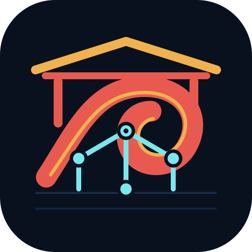

  

# HTML Share — Tailscale ドキュメント

[English documentation](/) · [日本語README](https://github.com/Sunwood-ai-labs/html-share-tailscale/blob/main/README.ja.md)

HTML Share — Tailscaleは、Tailscale Serveを入口にするローカル優先のHTMLダッシュボードです。サイトとレビュー状態はホストPCへ保存し、ネットワーク境界はTailnetに置きます。

## ガイド

- [初回セットアップ](guide/setup.md) — インストール、`.env`、公開、Tailscale Serve
- [使い方](guide/usage.md) — レポート登録、期限付きリンク、端末間のレビュー受け渡し
- [アーキテクチャ](guide/architecture.md) — ローカルサイト、データ、API、Tailnet経路
- [セキュリティ設計](guide/threat-model.md) — Tailnet境界が守るもの、守らないもの
- [トラブルシューティング](guide/troubleshooting.md) — 設定、ポート、ページが出ない場合

## プロジェクトリンク

- [英語ガイド](/)
- [日本語README](https://github.com/Sunwood-ai-labs/html-share-tailscale/blob/main/README.ja.md)
- [ブランドの考え方](https://github.com/Sunwood-ai-labs/html-share-tailscale/blob/main/assets/brand/README.md)
